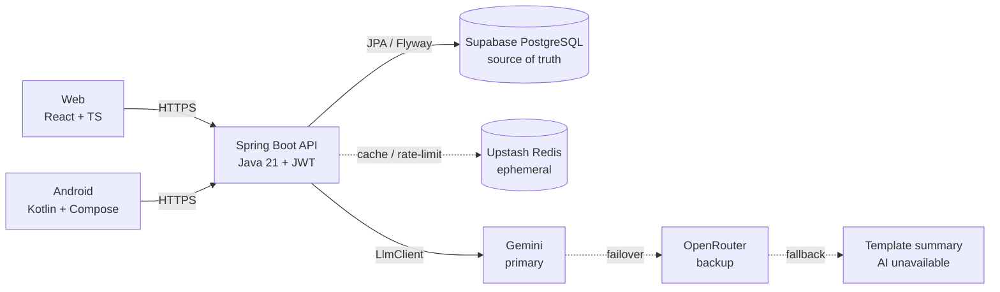
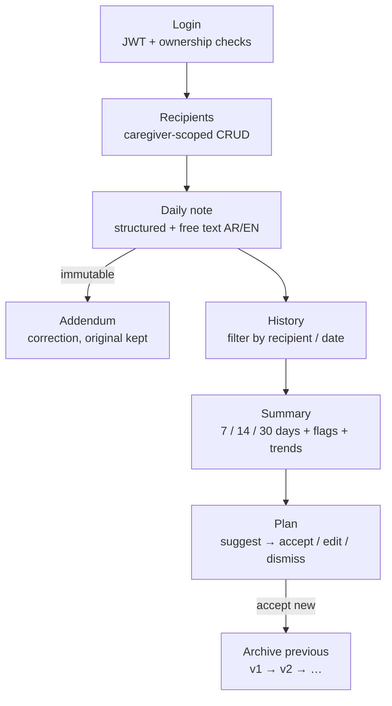
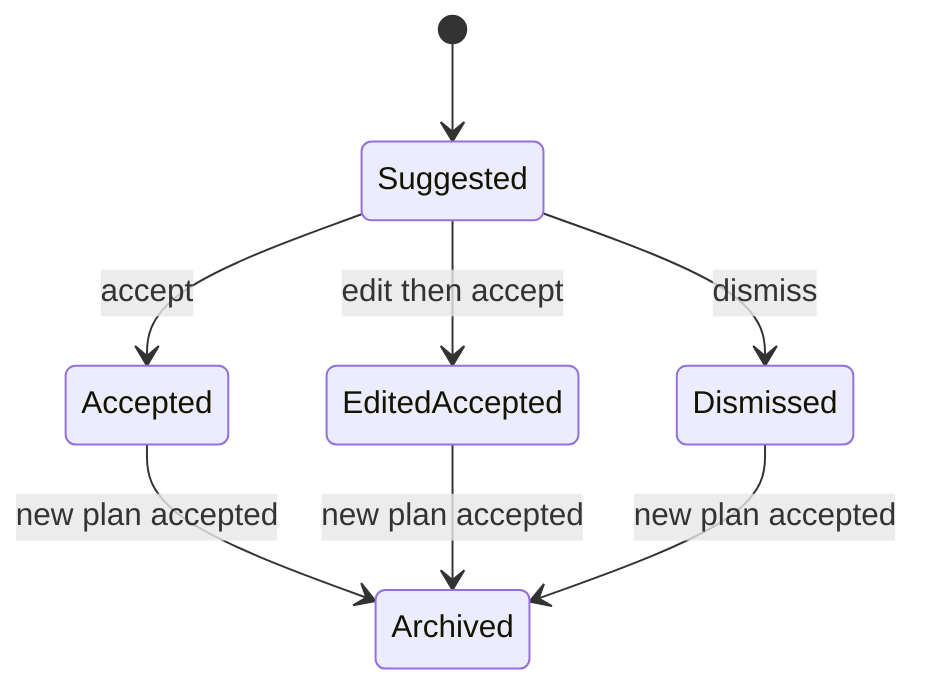

# Caregiver Daily Notes

A cloud-hosted care-support system for caregivers to record structured daily observations, generate grounded AI summaries, and manage AI-suggested care plans — in Arabic and English.

> **Disclaimer:** Care-support suggestions generated from your notes. Not medical advice. Synthetic data only — do not use with real patient data.

## Highlights

- **One caregiver role**, strict ownership — each caregiver sees only their own recipients
- **Structured + free-text notes** (AR / EN / mixed), append-only with addendums — never edited in place
- **On-demand AI summaries** (7 / 14 / 30 days) with deterministic safety flags, grounding, and fallbacks
- **AI-suggested care plans** from a fixed action catalog — accept, edit-and-accept, dismiss, versioned
- **Bilingual UI with RTL** — same workflows in العربية and English on web and Android
- **Backend-enforced safety** — red flags, trends, medication lock, and validators run server-side

## Architecture



- Backend is the source of truth for auth, business rules, AI validation, versioning, and audit.
- Clients are thin: web and Android consume the same REST API, no shared frontend code, no separate databases.
- LLM is behind an `LlmClient` interface — provider/model can change without touching app logic.

See [ARCHITECTURE.md](./ARCHITECTURE.md) for boundaries, ownership, and dependency rules.

## Tech Stack

| Layer | Stack |
|---|---|
| Backend | Java 21, Spring Boot 3.3, Maven, Spring Security + JWT, JPA / Flyway, springdoc OpenAPI |
| Database | Supabase PostgreSQL (persistent source of truth, versioned migrations) |
| Cache | Upstash Redis (LLM cache, regeneration limits — never source of truth) |
| Web | React + TypeScript, i18n AR/EN, RTL, Playwright + axe |
| Mobile | Native Kotlin, Jetpack Compose + Material3, Gradle, JUnit + Compose UI tests |
| AI | OpenAI-compatible Chat Completions (`ChatCompletionsLlmClient`), `FakeLlmClient` in tests |
| Infra | Local JVM + Cloudflare Tunnel (demo sharing), Cloudflare (web), GitHub Actions, GitHub Releases (APK) |

## Repository Structure

```text
.
├── backend/   # Spring Boot API — auth, recipient, notes, plans, ai, audit, common, config
│   ├── src/main/java/com/caregiver/
│   ├── src/main/resources/db/migration/  # Flyway migrations (V1__, V2__, …)
│   └── src/main/resources/prompts/        # AI prompt templates
├── web/src/   # React app — app/, features/{auth,recipients,notes,history,ai,plans}, components/, lib/, i18n/
├── android/   # Native app — com.caregiver.mobile (core/, data/, presentation/)
├── docs/      # api/, ai/eval-harness + golden/, demo/, security/, privacy/, testing/, releases/
├── .github/workflows/  # ci.yml, android.yml
├── ARCHITECTURE.md
└── .env.example
```

## Quickstart

### 1. Prerequisites

- Java 21 + Maven (backend)
- JDK 17 + Android SDK 35 (Android only)
- Node 20+ (web, when `web/package.json` lands)
- Supabase Postgres + Upstash Redis accounts for real runs

### 2. Configure environment

```bash
cp .env.example .env
# fill in real values — never commit .env
source .env
```

| Variable | Purpose |
|---|---|
| `DATABASE_URL`, `DATABASE_USERNAME`, `DATABASE_PASSWORD` | Supabase Postgres (pooler URL preferred) |
| `JWT_SECRET` | JWT signing secret (`openssl rand -base64 32`) |
| `GEMINI_API_KEY` | Primary LLM key (optional locally — falls back to “AI unavailable”) |
| `OPENROUTER_API_KEY` | Backup LLM key (optional) |
| `REDIS_URL` | Upstash Redis (optional cache) |

Canonical names must match GitHub Actions Secrets.

### 3. Run the backend

```bash
mvn -f backend/pom.xml spring-boot:run
# API: http://localhost:8080
# OpenAPI: http://localhost:8080/swagger-ui.html
```

Share with phone / evaluators:

```bash
cloudflared tunnel --url http://localhost:8080
```

Both clients read the backend base URL from a single runtime setting — a fresh tunnel URL never requires a rebuild.

### 4. Run the clients

**Android:**

```bash
cd android
./gradlew :app:assembleDebug          # → app/build/outputs/apk/debug/app-debug.apk
./gradlew :app:testDebugUnitTest       # unit tests, no device needed
./gradlew :app:connectedDebugAndroidTest  # UI tests, needs emulator/device
```

**Web:** scaffold under `web/src/` (see `web/` owners). Once wired:

```bash
# cd web && npm install && npm run dev
```

## Core Workflows



1. **Login** → JWT, server-side ownership checks + IDOR protection on every request
2. **Recipients** → caregiver-scoped CRUD
3. **Daily note** → mood, appetite, sleep, mobility, meds taken, pain 0–10, falls + free text
4. **Correction** → addendum note (original immutable)
5. **History** → filter by recipient / date, full audit trail
6. **Summary** → 7/14/30-day grounded summary + deterministic flags + trends + uncertainties
7. **Plan** → Suggested → Accepted / Edited-and-Accepted / Dismissed → Archived, versioned `v1 → v2 → …`



## AI Safety (enforced by backend)

- **Deterministic red flags** (falls, high pain, missed meds, poor appetite streaks) — LLM can raise urgency, never lower it
- **Backend trends** — LLM never computes trends
- **Fixed action catalog** — LLM selects/parameterizes allowed items with evidence, invents nothing
- **Medication hard lock** — any add/remove/dose change by AI is rejected
- **Grounding** — observations cite note IDs + verbatim quotes, verified after Arabic normalization
- **Uncertainty preserved** — unclear/conflicting stays in `unclear_or_conflicting`
- **Prompt-injection defense** — notes are delimited untrusted data, never system instructions
- **Fail-safe** — 30s timeout, 2 backoff retries + 1 JSON-repair retry, template fallback, “AI unavailable” UI. Saving a note never depends on AI.

## Testing

```bash
mvn -f backend/pom.xml test          # unit: red flags, trends, plan transitions, validators, auth
# integration: Testcontainers + FakeLlmClient (timeout, 500, truncated JSON, bad enum, fake quotes, med edits)
cd android && ./gradlew :app:testDebugUnitTest
```

- **Decision-table tests** for red-flag combinations + boundaries
- **State-transition tests** for all legal / illegal plan transitions
- **Golden dataset** (~22 notes: MSA / Egyptian / mixed / messy / contradictory / injection) — red-flag recall, schema-valid rate, groundedness
- **Metamorphic**: irrelevant sentence, paraphrase, negation flips
- **Web**: Playwright core flows (AR/EN, RTL, mobile/desktop) + axe scan
- **Security**: cross-caregiver access must fail

CI (`ci.yml`, `android.yml`) runs backend, integration, web, and mobile checks + coverage on every push/PR. APK builds publish via GitHub Releases.

## Deployment

| Target | Where |
|---|---|
| Web | Cloudflare |
| API | Local JVM, shared via Cloudflare Tunnel (hosted PaaS deferred) |
| DB | Supabase |
| Cache | Upstash Redis |
| APK | GitHub Releases |

## Documentation

- [ARCHITECTURE.md](./ARCHITECTURE.md) — layout, domains, ownership
- [android/README.md](./android/README.md) — build, states, device walkthrough
- `docs/api/android-gaps.md` — known API gaps clients must not work around
- `docs/ai/eval-harness.md` + `docs/ai/golden/` — evaluation methodology
- `docs/demo/seed-demo.sh` — demo seeding
- `docs/releases/android-0.1.0-draft.md` — release notes draft

## Internationalization

Arabic + English everywhere, with proper RTL/bidi, locale-aware dates, and string-parity tests. Same features in both languages.

## Security & Privacy

HTTPS, JWT, server-side authz, IDOR protection, env-only secrets, input + AI-output validation, write audit log, least privilege, synthetic data only. Privacy considerations align with Egypt Personal Data Protection Law No. 151 of 2020 — see `docs/privacy/`.

## Contributing

Issues own the work. One issue = one scope. Read existing code first, don’t rewrite unrelated code, add required tests, keep PRs reviewable, never commit secrets, never merge your own PR. See `ARCHITECTURE.md` → Ownership boundaries.

## Scope

**In:** login, recipients, structured notes, addendums, history + filters, summaries, red flags, suggested plans + versioning, audit, AR/EN + RTL, web + Android, CI/CD, eval set.
**Out:** doctor role, approvals, plan diff, notifications, iOS, voice, offline, fine-tuning, confidence scores, Arabizi, diagnosis, monitoring, real patient data.

## Status

DEPI Software Testing capstone — implementation, tests, deployment, and evaluation tracked via GitHub milestones/issues on `preview/full-stack`.
